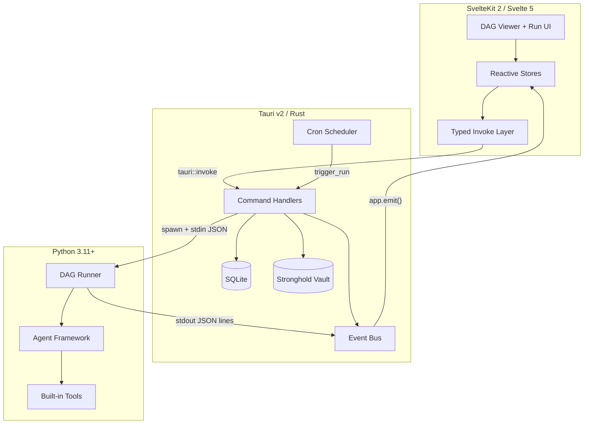

<div align="center">

# Atlas Weave

**Desktop Agent Orchestration Shell**

*A local-first Airflow for LLM-powered agent pipelines*


</div>

---

Atlas Weave is a desktop application for building, running, and monitoring LLM-powered agent pipelines. It combines a **SvelteKit** frontend with a **Rust/Tauri** shell and a **Python** agent runtime, connected by a real-time JSON event protocol.

Recipes are Python-defined DAGs of agents that execute locally with full visibility — every HTTP request, LLM call, and data transformation streams into a live execution graph. Cost tracking, cron scheduling, encrypted credential management, and desktop notifications are built in.

Unlike cloud orchestration tools, Atlas Weave runs entirely on your machine. Your data, API keys, and execution history never leave your desktop.

## Features

### Live DAG Execution Viewer
Real-time node status transitions, progress rings, edge flow animations, zoom/pan controls, minimap for large graphs, and auto-fit on recipe load.

### Agent Framework
Python ABC classes for defining agents with typed inputs/outputs. Declarative DAG definition via `Recipe` with topological execution, parallel agent support, and automatic failure propagation.

### Built-in Tool Suite
- **HttpTool** — HTTP client with auto event tracking (method, URL, status, duration)
- **LLMTool** — Claude API wrapper with token counting, cost estimation, and structured output
- **WebSearchTool** — Web search with configurable TTL caching
- **WebScrapeTool** — HTML parsing via BeautifulSoup with automatic HTTP event emission
- **SQLiteTool** — Recipe output database access with upsert helpers

### Data Inspector
Full-screen database browser with paginated tables, column sorting/filtering, text search, record detail view, coverage dashboards, and CSV export.

### Cron Scheduling
Cron-based automatic runs with overlap prevention, human-readable schedule descriptions, and next-run-time display.

### Run Management
Run history browser, real-time cancel, retry failed nodes (re-runs only failed/skipped agents), config persistence with secret redaction.

### Secure Credentials
Stronghold-encrypted storage for API keys. Credentials are injected as environment variables at runtime — never persisted in config JSON or logs.

### Desktop Notifications
Automatic OS notifications on run completion, failure, or cancellation.

## Architecture



## Tech Stack

| Layer | Technology | Role |
|-------|-----------|------|
| Frontend | SvelteKit 2, Svelte 5, TailwindCSS | UI, DAG visualization, reactive stores |
| Desktop | Tauri v2, Rust, SQLite, Stronghold | Event routing, persistence, scheduling, credentials |
| Runtime | Python 3.11+, Pydantic, httpx | Agent execution, LLM calls, web scraping |

## Quick Start

### Prerequisites

- **Rust** (latest stable) — [rustup.rs](https://rustup.rs)
- **Node.js** 18+ — [nodejs.org](https://nodejs.org)
- **Python** 3.11+ — [python.org](https://www.python.org)
- **pnpm** — `npm install -g pnpm`

### Setup

```bash
# Clone the repository
git clone <repo-url>
cd atlas-weave

# Install frontend dependencies
cd frontend/app
pnpm install
cd ../..

# Install Python dependencies
cd python
pip install -e ".[dev]"
cd ..

# Run in development mode
cargo tauri dev
```

## Creating a Recipe

Recipes live in `python/recipes/<name>/recipe.py`. Each recipe defines agents, their connections, and a config schema.

```python
from atlas_weave.agent import Agent, AgentResult
from atlas_weave.context import AgentContext
from atlas_weave.recipe import Recipe

class FetchAgent(Agent):
    name = "fetch_data"
    description = "Fetches data from an API"

    async def execute(self, ctx: AgentContext) -> AgentResult:
        http = ctx.tools.get("http")
        response = await http.call(ctx, url=ctx.config["api_url"])
        ctx.state["raw_data"] = response["body"]
        ctx.emit.node_progress(self.name, progress=1.0, message="Fetched data")
        return AgentResult(records_processed=1, summary="Data fetched")

class ProcessAgent(Agent):
    name = "process_data"
    description = "Processes fetched data with LLM"

    async def execute(self, ctx: AgentContext) -> AgentResult:
        llm = ctx.tools.get("llm")
        result = await llm.call(ctx, prompt=f"Summarize: {ctx.state['raw_data']}")
        return AgentResult(records_created=1, summary=result["content"])

RECIPE = Recipe(
    name="my_pipeline",
    description="Fetch and process data",
    version="1.0.0",
    agents=[FetchAgent, ProcessAgent],
    edges=[("fetch_data", "process_data")],
    config_schema={
        "api_url": {
            "type": "string",
            "required": True,
            "description": "API endpoint to fetch",
        },
        "claude_api_key": {
            "type": "string",
            "secret": True,
            "required": True,
            "description": "Anthropic API key",
        },
    },
)
```

<details>
<summary><strong>Project Structure</strong></summary>

```
atlas-weave/
├── apps/atlas-weave-shell/
│   └── src-tauri/src/
│       ├── commands/          # Tauri command handlers
│       ├── services/          # Event bus, sidecar, scheduler, credentials
│       ├── db.rs              # SQLite schema and queries
│       └── lib.rs             # App entry point
├── frontend/app/src/
│   ├── lib/
│   │   ├── api/tauri/         # Typed invoke wrappers
│   │   ├── components/ui/     # Reusable UI components
│   │   ├── features/          # DAG viewer, run management
│   │   └── stores/            # Svelte reactive stores
│   └── routes/                # SvelteKit pages
├── python/
│   ├── atlas_weave/           # Agent framework + built-in tools
│   │   ├── agent.py           # Agent ABC
│   │   ├── recipe.py          # Recipe definition
│   │   ├── runner.py          # DAG executor
│   │   ├── tools/             # HTTP, LLM, search, scrape, SQLite
│   │   └── events.py          # JSON event emitter
│   └── recipes/               # Recipe implementations
│       └── satellite_enrichment/
├── docs/
│   ├── ARCHITECTURE.md
│   └── IMPLEMENTATION_ROADMAP.md
└── Cargo.toml                 # Workspace root
```

</details>

## Satellite Enrichment Pipeline

The flagship recipe demonstrates Atlas Weave's capabilities: a 4-agent DAG that builds a comprehensive satellite database from multiple sources.

| Agent | Role |
|-------|------|
| **StructuredDataCollector** | Fetches from Space-Track (SATCAT + GP data), CelesTrak (48 categories), ESA DISCOS, and UCS |
| **RecordMerger** | Merges 10,000+ satellite records with priority-based field resolution, derives orbit class and constellation |
| **LLMResearcher** | Uses Claude to fill gaps for low-completeness records via web search + structured extraction |
| **QualityAuditor** | Validates orbital parameters, computes coverage metrics, flags anomalies |

The pipeline produces a SQLite database with 50+ fields per satellite, targeting 80%+ operator/purpose coverage and 70%+ mass data coverage.

## Roadmap

- [x] **Phase 1** — Skeleton: Tauri + SvelteKit + Python protocol
- [x] **Phase 2** — Agent Framework: DAG runner, topological execution
- [x] **Phase 3** — DAG Viewer: real-time visualization, node interaction
- [x] **Phase 4** — Run Management: history, config, cancel, credentials
- [x] **Phase 5** — Built-in Tools: HTTP, LLM, search, scrape with auto-tracking
- [x] **Phase 6** — Satellite Enrichment: 4-agent pipeline, multi-source fusion
- [x] **Phase 7** — Data Inspector: full-screen DB browser, coverage dashboards
- [x] **Phase 8** — Scheduling: cron-based runs, overlap prevention
- [x] **Phase 9** — Polish: theme toggle, notifications, retry, keyboard shortcuts, README

## License

[PolyForm Noncommercial 1.0.0](LICENSE) — free for personal, research, and non-commercial use. Commercial use is not permitted.
